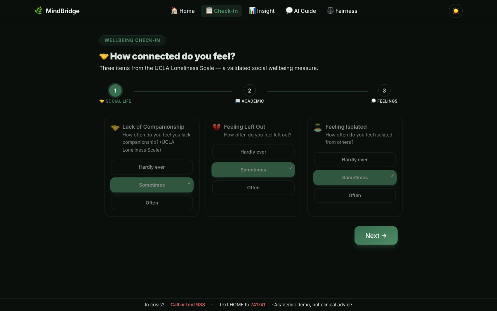

# MindBridge: AI Student Wellness Check In

**HAII Spring 2026 · Option B Final Project**

MindBridge is a web application that helps university students understand their anxiety risk through a validated screening tool, explainable ML predictions, an AI wellness guide, and a live fairness explorer.

> ⚠️ **Academic demonstration only.** Not a clinical tool. Not a medical service. In crisis, call or text **988**.

---

## Quick Start

### Prerequisites

- Python 3.10+ with a virtual environment
- Node.js 18+
- An OpenAI API key

### 1. Install Python dependencies

```bash
pip install -r requirements.txt
```

### 2. Install frontend dependencies

```bash
cd web && npm install && cd ..
```

### 3. Configure environment

Create a `.env` file in the project root:

```env
OPENAI_API_KEY=sk-...
OPENAI_MODEL=gpt-4o-mini
```

### 4. Prepare HMS data (first time only)

Request and download access-approved Healthy Minds Study data from the [Healthy Minds Network Data for Researchers page](https://healthymindsnetwork.org/research/data-for-researchers/), then place the raw export in your local `Data/` directory (do not commit raw data files).

```bash
python scripts/clean_hms.py
python scripts/process_data.py
```

### 5. Train the model (first time only)

```bash
python scripts/train_model.py
```

This produces `models/xgb_regressor.pkl`, `xgb_classifier.pkl`, `shap_explainer.pkl`, and `fairness_report.json`.

### 6. Start the app

```bash
bash start.sh
```

This launches:
- FastAPI backend at `http://localhost:8000`
- Next.js frontend at `http://localhost:3000`

Open `http://localhost:3000` in your browser.

---

## Project Structure

```
HAI_Project_claude/
├── api/                        # FastAPI backend
│   ├── main.py                 # App factory, CORS, router mounting
│   └── routers/
│       ├── predict.py          # POST /api/predict
│       ├── chat.py             # POST /api/chat/stream (SSE)
│       └── fairness.py         # GET /api/fairness, GET /api/meta
├── src/
│   ├── llm/
│   │   └── chat.py             # OpenAI streaming wrapper + system prompt
│   ├── model/
│   │   └── predict.py          # XGBoost inference + SHAP explanations
│   └── utils/
│       └── constants.py        # Feature metadata, tier thresholds
├── web/                        # Next.js 14 frontend
│   └── src/
│       ├── app/
│       │   ├── page.tsx        # Home / landing
│       │   ├── assessment/     # 3-step check-in wizard
│       │   ├── results/        # Gauge, SHAP bars, recommendations
│       │   ├── chat/           # AI wellness guide (streaming chat)
│       │   ├── fairness/       # Fairness explorer with Recharts
│       │   ├── layout.tsx      # Root layout (Navbar, crisis strip)
│       │   └── template.tsx    # Page transition animation
│       ├── components/
│       │   ├── layout/         # Navbar, ThemeInit
│       │   ├── results/        # GaugeChart, ShapBars
│       │   └── ui/             # Card, Button
│       ├── hooks/
│       │   └── useStore.ts     # Zustand store (assessment, chat state)
│       └── lib/
│           ├── api.ts          # Typed fetch wrappers + SSE reader
│           ├── constants.ts    # Feature metadata (TS mirror of Python)
│           └── utils.ts        # cn(), scoreToTier(), tier styles
├── models/                     # Trained artifacts (git-ignored)
├── scripts/
│   ├── train_model.py          # XGBoost + SHAP + fairness training
│   ├── clean_hms.py            # Raw HMS data cleaning
│   └── process_data.py         # Feature engineering pipeline
├── Data/
│   └── processed/              # ML-ready CSVs
├── start.sh                    # Starts both servers
├── requirements.txt
└── .env                        # API keys (never commit)
```

---

## Application Pages

| Page | Route | Description |
|------|-------|-------------|
| Home | `/` | Landing with animated hero, feature overview, HAII principles table |
| Check-In | `/assessment` | 3-step wizard: 11 questions across social, academic, and mood domains |
| Insight | `/results` | GAD-7 score + gauge, 80% CI, SHAP factor bars, tier-specific recommendations |
| AI Guide | `/chat` | Streaming chat with GPT-4o-mini grounded in the user's prediction context |
| Fairness | `/fairness` | Live fairness metrics by Gender, Race, International status, Sexual Orientation |

---

## Screenshots

### Assessment Flow



---

## ML Pipeline

**Model:** XGBoost Regressor (GAD-7 score 0 to 21) + XGBoost Binary Classifier (moderate+ anxiety)

**Dataset:** Healthy Minds Study 2024 to 2025 (`n = 61,393` after cleaning), obtained via approved researcher access request

**Features (11):**
- Loneliness: `lone_lackcompanion`, `lone_leftout`, `lone_isolated`
- Academic: `aca_impa`, `persist`, `yr_sch`
- PHQ-9 proxy items: `phq9_1`, `phq9_2`, `phq9_3`, `phq9_4`, `phq9_6`

**Performance (held-out test set):**
- Regressor MAE: **2.94** (0 to 21 scale)
- Classifier AUC-ROC: **0.871**

**Explainability:** SHAP TreeExplainer, per prediction factor attribution shown as animated bars ranked by |SHAP value|

**Confidence intervals:** ±1.28σ residuals → 80% CI displayed on every prediction

**Fairness evaluation:** Subgroup metrics (demographic parity, equalized odds, calibration error) computed on held out data across Gender, Race, International status, and Sexual Orientation, accessible in the Fairness Explorer.

---

## Tech Stack

| Layer | Technology |
|-------|-----------|
| Frontend | Next.js 14 (App Router), TypeScript, Tailwind CSS |
| Animation | Framer Motion (spring-physics gauge, stagger, page transitions) |
| Charts | Recharts (fairness dashboard), custom SVG (gauge) |
| State | Zustand |
| Backend | FastAPI + Uvicorn |
| Streaming | Server-Sent Events (SSE) via `StreamingResponse` |
| LLM | OpenAI (`gpt-4o-mini`, configurable via `OPENAI_MODEL`) |
| ML | XGBoost, SHAP, scikit-learn, pandas, numpy |
| Theme | CSS custom properties, dual dark/light via `[data-theme]` selector |

---

## HAII Design Principles

| Principle | Implementation |
|-----------|---------------|
| MS Guidelines 1 to 2 | Non diagnosis disclaimer on every page + crisis strip |
| MS Guideline 9 (correction) | Back button in wizard, Recalculate on results |
| MS Guidelines 10 to 11 (scope + explain) | 80% CI on every prediction; SHAP bars explain *why* |
| Designing for failures (§2) | FP/FN cost framing shown on results page |
| Fairness (§4 to 5) | Live subgroup metrics explorer across 4 demographic axes |
| Auditing (§6) | Synthetic audit cases in fairness report |
| RAI in practice (§11) | Crisis redirection, AI disclosure on every chat bubble |
| Transparency (§12 to 13) | SHAP waterfall + factor attribution |
| Privacy | Session-only state; no PII stored; no server-side logging of answers |

---

## Environment Variables

| Variable | Required | Default | Description |
|----------|----------|---------|-------------|
| `OPENAI_API_KEY` | Yes | N/A | OpenAI secret key |
| `OPENAI_MODEL` | No | `gpt-4o-mini` | Any OpenAI chat model ID |

---

## Data & Privacy

- **Source:** Healthy Minds Study 2024 to 2025 restricted access dataset (Healthy Minds Network)
- **Access required:** The dataset is not uploaded to this repository and cannot be redistributed on GitHub; request access through the [Healthy Minds Network Data for Researchers page](https://healthymindsnetwork.org/research/data-for-researchers/)
- **No PII stored:** Assessment answers live only in the browser session (Zustand in-memory store)
- **No server-side logging:** The FastAPI backend does not persist any user inputs
- **Protected attributes excluded from model inputs:** Gender, race, and orientation inform only the fairness audit, not predictions
- **Not nationally representative** without HMS survey weights (`nrweight`)
